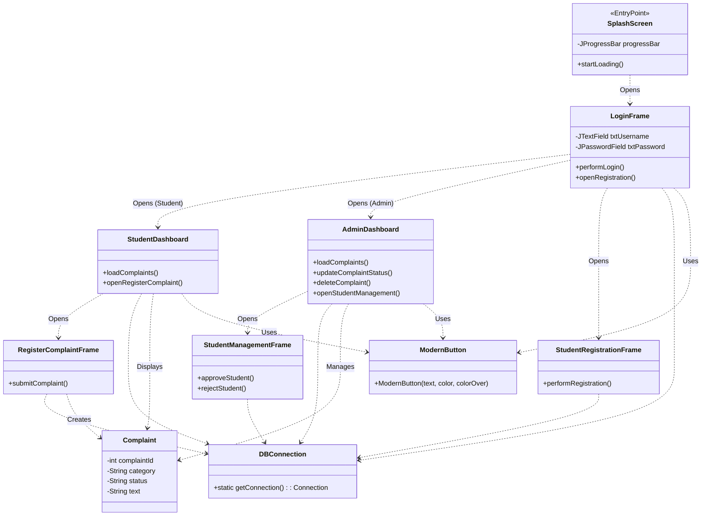

# Project Documentation

## 1. Project Title
**Student Complaint Management System (SCMS)**

## 2. Introduction
The **Student Complaint Management System (SCMS)** is a comprehensive Java Swing-based desktop application designed to streamline the process of handling student grievances within an educational institution. The system bridges the communication gap between students and the administration by providing a digital platform for lodging, tracking, and resolving complaints.

### Key Objectives:
*   **Efficiency:** Replace manual paperwork with a digital workflow.
*   **Transparency:** Allow students to track the real-time status of their complaints.
*   **Accountability:** Enable administrators to manage and resolve issues systematically.

### User Roles:
1.  **Student:**
    *   Secure login and registration.
    *   Register new complaints with specific categories (e.g., Hostel, Library, Academics).
    *   View a dashboard of their complaint history and current status (Pending, In Progress, Resolved).
2.  **Administrator:**
    *   Secure login.
    *   View all complaints from all students.
    *   Update the status of complaints.
    *   Manage student registrations (Approve/Reject new student accounts).

### Technical Highlights:
*   **UI/UX:** Features a modern, dark-themed interface with custom components (rounded buttons, toast notifications, custom title bars) and smooth animations.
*   **Database:** Utilizes an Oracle Database for robust data persistence.
*   **Security:** Implements role-based access control.

## 3. Class Diagram

The following diagram illustrates the structure of the application, showing the relationships between the main User Interface (UI) classes, the Database Connection utility, and the flow of the application.

